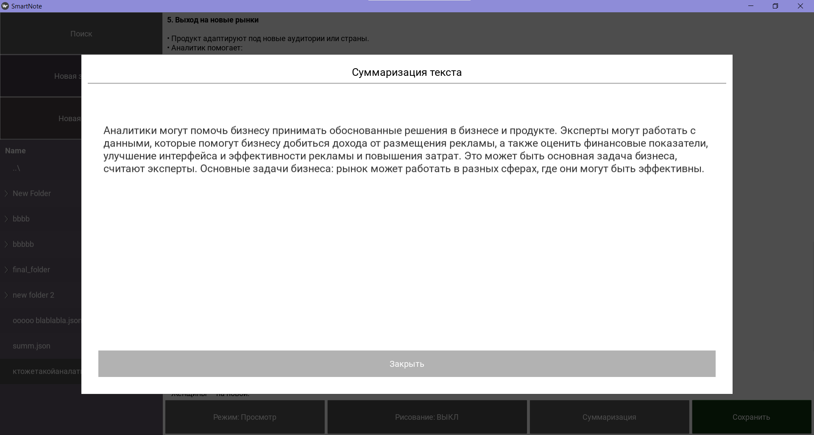
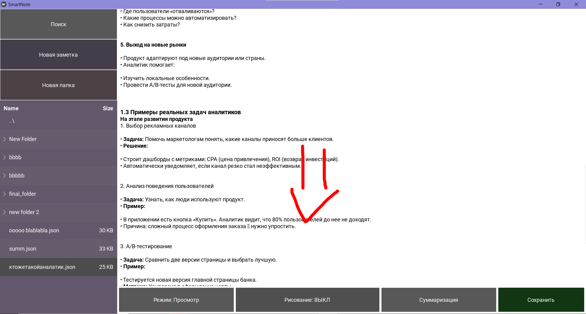

# SmartNotes это про удобство
Это проект, разрабатываемый мной и моим однокурсником для облегчения ведения конспектов и прочих записей во время обучения.

## Чем же он выделяется среди других программ для ведения заметок?
Мы хотели решить две основных проблемы:
- огромный объем записей, в которых можно легко потеряться
- громоздкость добавления рисунков

Первую проблему мы решили добавлением встроенной в приложение легкой языковой модели, оптимизированной под работу на железе пользователя (подробнее в ML/notebooks). Благодаря ней вы можете быстро оценить содержание написанного конспекта!

Вторую проблему мы решили наложением доп слоя на окно рисования. Теперь вы можете писать и рисовать поверх записей!

[ссылка на скачивание приложения](https://drive.google.com/drive/folders/18TkAUoISElti_nrq3maMEIn_73YyUV-E?usp=sharing)
